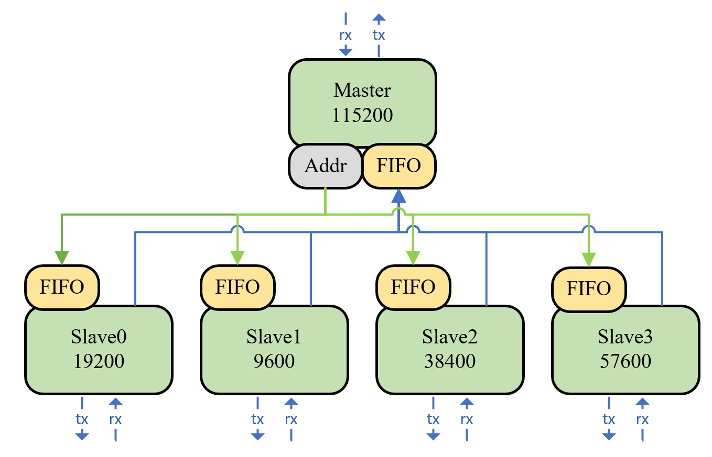

# 基于FPGA的串口路由器

##### 工程介绍：

> 本工程是一个串口路由收发器，路由的主端口通过比特率为115200的串口接到pc端，剩下四个从端口接到一些收发的从设备上，主端口发送0xf0-0xf3这四个从设备地址与子设备建立通讯，由于主设备的通讯速率较高，从串口无法实时的发送给从设备，因此加入一个深度为100的FIFO缓存要发送的数据，从串口会实时检测FIFO，直至读空。从设备发送数据给主串口时也同理，发送的数据先经过FIFO，主串口会检测FIFO直至读空

##### 实现框图：

